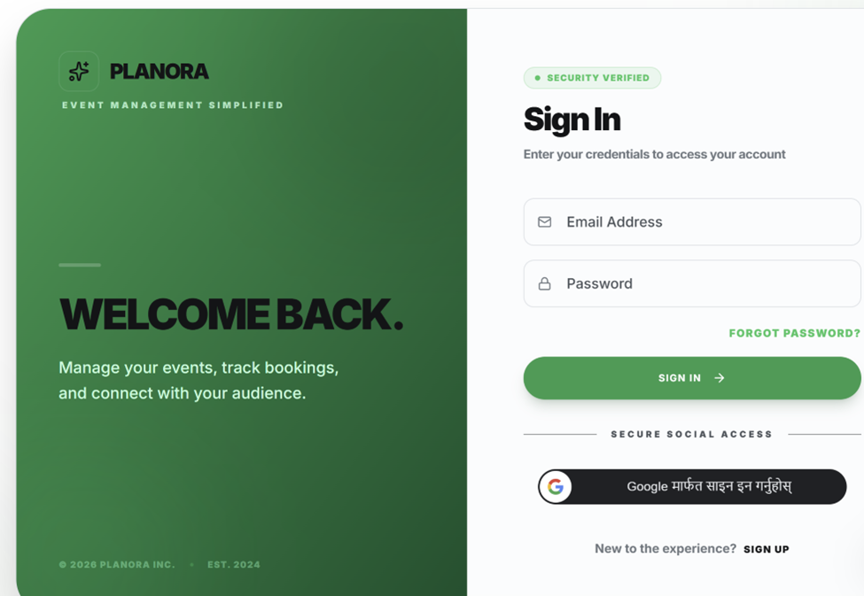
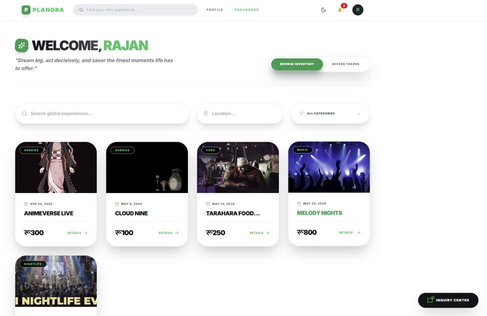
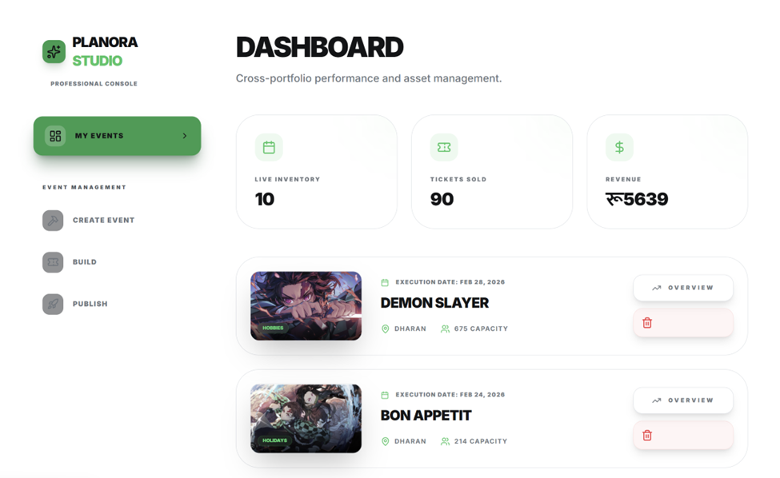
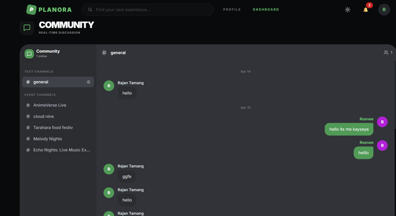

# EventBooking Management System

A web-based system designed to help users manage and access event information easily. The system provides features such as user registration, login, event booking, and real-time community interaction.

## Project Objective
The main objective of this project is to develop a system that solves the problem of manual event management and improves user experience through a simple, efficient, and interactive interface for both attendees and organizers.

## Features
The system provides the following features:
* **User Authentication**: Secure registration, login, and email verification.
* **Role-Based Dashboards**: Separate specialized interfaces for Attendees, Organizers, and Super Admins.
* **Event Management**: Create, search, and manage events with location data and dynamic pricing.
* **Community Chat**: Real-time Discord-style chat for event attendees.
* **AI Recommendations**: Personalized event suggestions powered by Google Gemini.
* **Ticket System**: Purchase tickets and generate downloadable PDFs.
* **KYC Verification**: Secure organizer verification process.
* **Secure Logout**: Complete session management.

## Technologies Used

### Frontend
* HTML5 & CSS3
* JavaScript (ES6+)
* **React** (Vite)
* **Tailwind CSS** (for styling)
* **Framer Motion** (for animations)
* **Socket.io-client** (for real-time chat)

### Backend
* **Node.js**
* **Express.js**
* **Socket.io** (for WebSocket communication)
* **Nodemailer** (for email services)

### Database
* **MongoDB** (via Mongoose)

### Deployment
* **Vercel** (Frontend)
* **Render** (Backend)

## System Requirements

### Hardware
* Computer or smartphone
* Internet connection

### Software
* Modern Web browser (Chrome, Firefox, Edge, etc.)
* **Node.js** installed (v18.x or later recommended)
* **npm** or **yarn** package manager

## Installation and Setup

Steps to run the project locally:

1. **Clone the repository**
   ```bash
   git clone https://github.com/Roshnitamang/Roshni-Tamang-EventBooking-ManagementSystem.git
   ```

2. **Go to the project folder**
   ```bash
   cd evntweb
   ```

3. **Install required dependencies**

   *For the Logic Server (Backend):*
   ```bash
   cd serverside
   npm install
   ```

   *For the UI (Frontend):*
   ```bash
   cd ../frontend
   npm install
   ```

4. **Environment Configuration**
   Create a `.env` file in the `serverside` directory and add your credentials (MongoDB URI, JWT Secret, SMTP settings, etc.).

5. **Run the application**

   *Start the Backend:*
   ```bash
   cd serverside
   npm run dev
   ```

   *Start the Frontend:*
   ```bash
   cd frontend
   npm run dev
   ```

## Live Project
Live URL of the deployed system:
[Click here to view live](https://roshni-tamang-event-booking-managem-five.vercel.app)

## Project Structure
```
evntweb/
├── frontend/           # React + Vite application
│   ├── src/            # Components, Pages, Assets
│   └── package.json
├── serverside/         # Node.js + Express API
│   ├── config/         # DB and Middleware configs
│   ├── controllers/    # API logic
│   ├── models/         # MongoDB schemas
│   ├── routes/         # API endpoints
│   └── server.js       # Entry point
└── README.md
```

## Screenshots
* *(Add screenshots here after hosting or local run)*
* **Login Page**: 
* **Attendee Dashboard**: 
* **Organizer Dashboard**: 
* **Community Chat**: 

## Future Improvements
* **Mobile Application**: Native Android/iOS version using React Native.
* **Payment Gateway**: Integration of Khalti/ESewa or Stripe for real-world transactions.
* **Enhanced Analytics**: More detailed reports for organizers.
* **Multi-language Support**: Accessibility for more users.

## Authors
**Roshni Tamang**  
Final Year Project  
[University/College Name Placeholder]

## License
This project is created for educational purposes as part of a Final Year Project.
